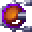
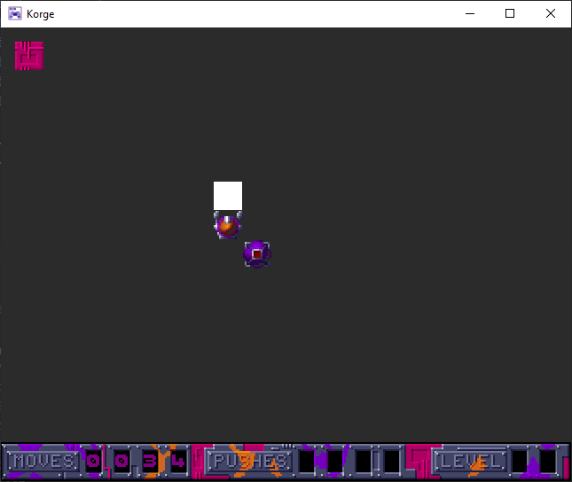

#  Movem

Game being worked on by [James Lendrem](https://github.com/Corofides/) and [Alex Hedley](https://github.com/alexhedley/)

## Docs

- [Docs](docs/README.md)
- [api](https://corofides.github.io/Movem/api/) LIVE
- [tests](https://corofides.github.io/Movem/tests/) LIVE
- [coverage](https://corofides.github.io/Movem/coverage/) LIVE

### Progress

Create a scene, create a player, allow movement in four cardinal directions, change images to reflect movement. Started adding a background.
Restrict movement to 32, 32 grid based system for player, add in object that will be moveable in the future, add in view for detecting collisions with dense objects in front of player.

## Info

Coder : Hironymus Jumpshoe

Graphician : MC Mad Brush

Musician : Mr. Dux

Year of release: 1989

- [Hall Of Light](https://hol.abime.net/4770)

## More

- [Changelog](CHANGELOG.md)
- [Contributors](CONTRIBUTORS.md)
- [Acknowledgements](ACKNOWLEDGEMENTS.md)
