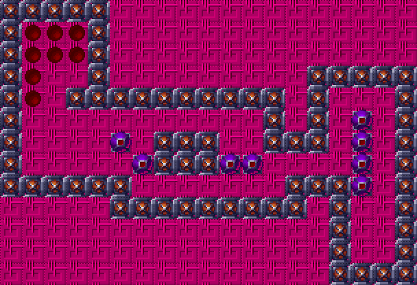

# Levels

- [Movem LevelMaker macOS](https://github.com/AlexHedley/Movem-LevelMaker-macOS)

```
LevelData(tiles: [
 [0,0,0,0,0,0,0,0,0,0,0,0,0,0,0,1,1,1,1]
,[0,0,0,0,0,0,0,0,0,0,0,0,0,0,0,1,0,0,1]
,[0,0,0,0,0,0,0,0,0,0,0,0,0,0,0,1,0,0,1]
,[0,0,0,0,0,1,1,1,1,1,1,1,1,1,0,1,0,0,1]
,[1,1,1,1,1,1,0,0,0,0,0,0,0,1,1,1,0,0,1]
,[1,0,0,0,0,0,0,1,1,1,0,0,0,0,0,0,0,0,1]
,[1,0,0,0,0,0,0,1,1,1,0,0,1,1,1,0,0,0,1]
,[1,0,0,0,0,0,0,0,0,0,0,0,1,0,1,0,0,0,1]
,[1,0,0,1,1,1,1,1,1,1,1,1,1,0,1,0,0,0,1]
,[1,0,0,0,1,0,0,0,0,0,0,0,0,0,1,1,1,1,1]
,[1,0,0,0,1,0,0,0,0,0,0,0,0,0,0,0,0,0,0]
,[1,0,0,0,1,0,0,0,0,0,0,0,0,0,0,0,0,0,0]
,[1,1,1,1,1,0,0,0,0,0,0,0,0,0,0,0,0,0,0]
],
boxes: [[16,7],[5,6],[16,6],[6,5],[10,5],[11,5],[16,5],[16,4]],
goals: [[1,11],[2,11],[3,11],[1,10],[2,10],[3,10],[1,9],[1,8]],
start: [16,3]
)
```



")